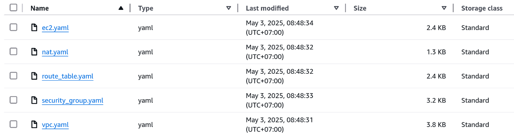
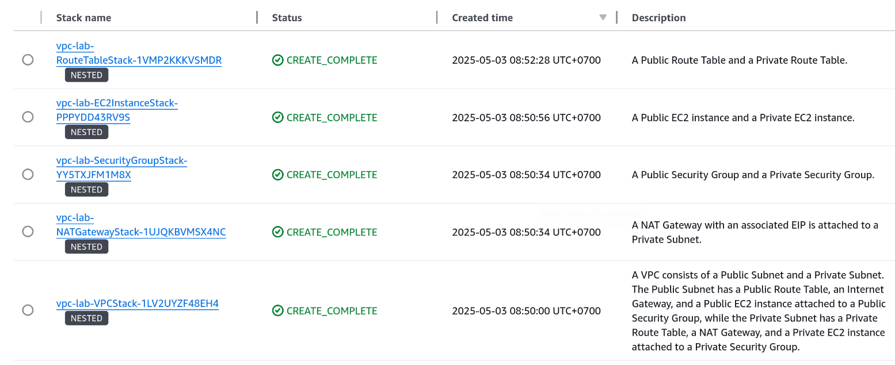

# Cloudformation for managing and deploying AWS infrastructure

## Overview

This project uses Cloudformation to mangage and deploy a simple VPC including public and private subnets, Internet Gateway, route tables, Nat Gateway, Security Groups and EC2 instances.

## Prerequisites

- [AWS CLI](https://docs.aws.amazon.com/cli/latest/userguide/install-cliv2.html)
- An **S3 bucket** where you'll upload the nested stack templates.

## Getting Started

### Step 1: Configure AWS CLI

```bash
aws configure --profile your_profile_name
```

**Note:**
- ```your_profile_name```: Your AWS CLI profile.

### Step 2: Clone the repository

### Step 3: Upload nested stack templates

1. Execute the Bash script on Linux

```bash
chmod +x deploy.sh
sudo ./deploy.sh
```

2. Refresh the S3

<p align="center">
    </img>
</p>

Ensure that all files are accessible from the Internet (development environment only).

### Step 4: Create parameters.json file

Example

```json
[
    {
        "ParameterKey": "Environment",
        "ParameterValue": "your_environment"
    },
    {
        "ParameterKey": "ProjectName",
        "ParameterValue": "your_project_name"
    },
    {
        "ParameterKey": "Owner",
        "ParameterValue": "your_name"
    },
    {
        "ParameterKey": "BucketName",
        "ParameterValue": "your_bucket_name"
    },
    {
        "ParameterKey": "VpcName",
        "ParameterValue": "my-vpc-01"
    },
    {
        "ParameterKey": "VpcCIDR",
        "ParameterValue": "10.0.0.0/16"
    },
    {
        "ParameterKey": "PublicSubnetName",
        "ParameterValue": "public-subnet-01"
    },
    {
        "ParameterKey": "PublicSubnetCIDR",
        "ParameterValue": "10.0.0.0/20"
    },
    {
        "ParameterKey": "PrivateSubnetName",
        "ParameterValue": "private-subnet-01"
    },
    {
        "ParameterKey": "PrivateSubnetCIDR",
        "ParameterValue": "10.0.16.0/20"
    },
    {
        "ParameterKey": "PublicSecurityGroupName",
        "ParameterValue": "public-sg-01"
    },
    {
        "ParameterKey": "PrivateSecurityGroupName",
        "ParameterValue": "private-sg-01"
    },
    {
        "ParameterKey": "SSHIP",
        "ParameterValue": "0.0.0.0/0"
    },
    {
        "ParameterKey": "AMI",
        "ParameterValue": "ami-0e8ebb0ab254bb563"
    },
    {
        "ParameterKey": "InstanceType",
        "ParameterValue": "t2.micro"
    },
    {
        "ParameterKey": "KeyName",
        "ParameterValue": "ssh-key"
    },
    {
        "ParameterKey": "PublicEC2Name",
        "ParameterValue": "public-ec2-01"
    },
    {
        "ParameterKey": "PrivateEC2Name",
        "ParameterValue": "private-ec2-01"
    }
]
```

**Note:**
- ```your_environment```: Your environment.
- ```your_project_name```: Your project name.
- ```Owner```: Your name.
- ```your_bucket_name```: Your S3 bucket name where your template files are stored.
- ```SSHIP```: your IPv4. For instance: 14.169.70.31/32.
- ```KeyName```: Name of key pair to SSH. You have to create a key pair before deploying stack.

### Step 5: Deploy the Stack

```bash
aws cloudformation deploy \
  --stack-name your_stack_name \
  --template-file ./root.yaml \
  --capabilities CAPABILITY_NAMED_IAM \
  --region your_region \
  --profile your_profile_name \
  --parameter-overrides file://parameters.json
```

**Note:**
- ```your_stack_name```: The name of your CloudFormation stack.
- ```your_region```: The region that you deploy stack.
- ```your_profile_name```: Your AWS CLI profile.

<p align="center">
    </img>
</p>

### Step 6: Delete the Stack

```bash
aws cloudformation delete-stack \
  --stack-name your_stack_name \
  --region your_region \
  --profile your_profile_name \
```

**Note:**
- ```your_stack_name```: The name of your CloudFormation stack.
- ```your_region```: The region that you deploy stack.
- ```your_profile_name```: Your AWS CLI profile.